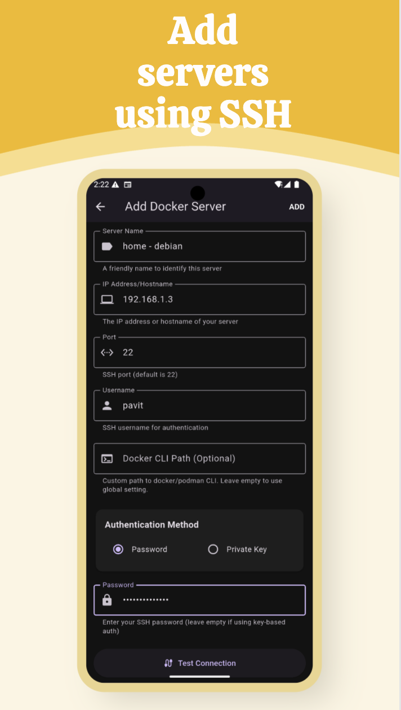
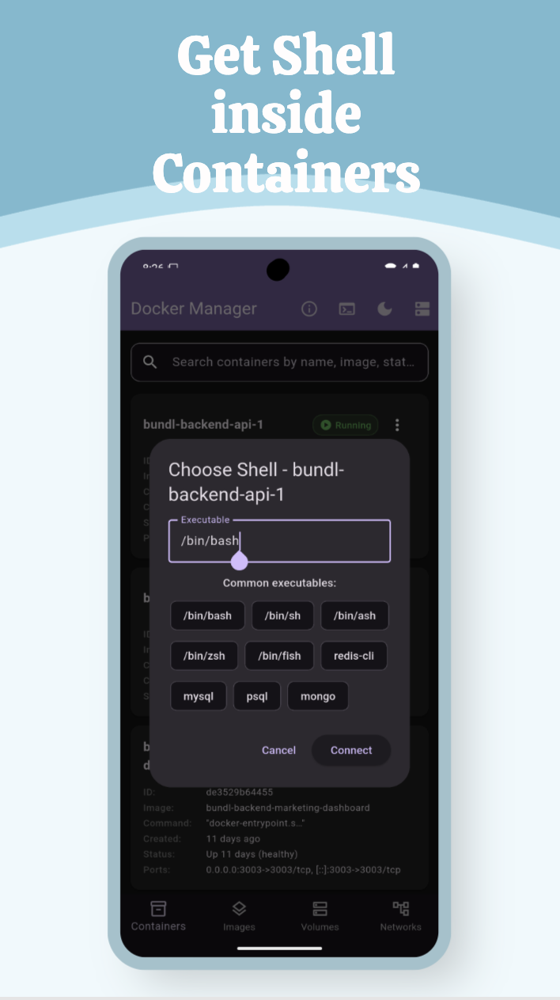
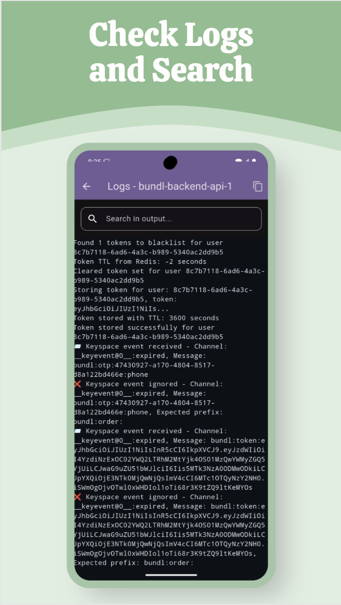
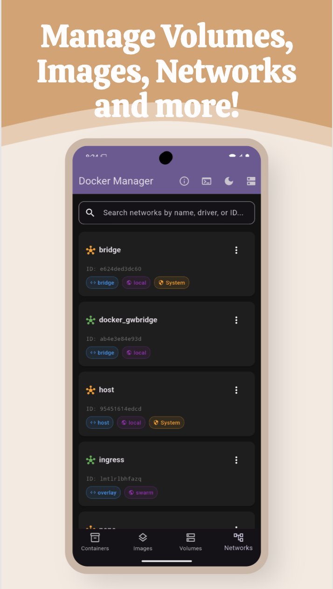
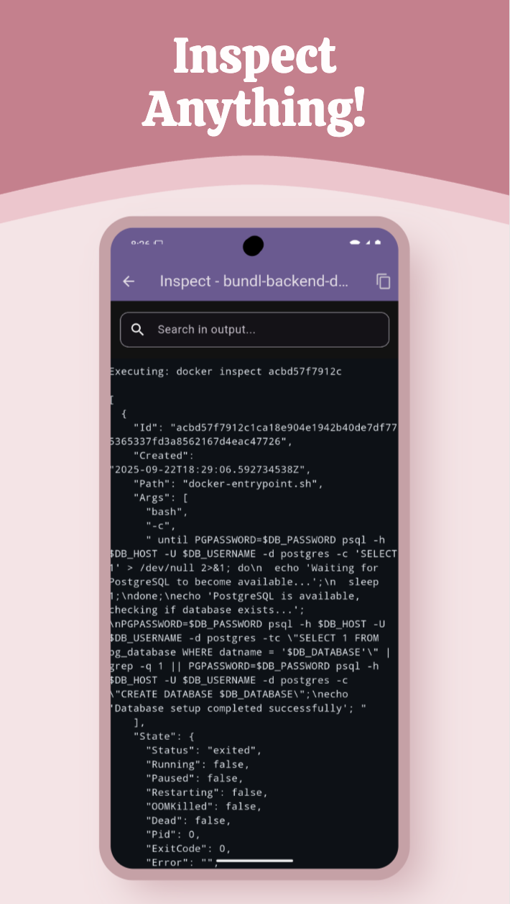

# Docker Manager

A mobile application for managing Docker containers, images, networks, and volumes from your phone.

## Screenshots

  
  
  
  

  
  

## Overview

Docker Manager is designed for anyone who self-hosts applications and needs a convenient way to manage their Docker infrastructure remotely. Instead of opening a laptop and SSHing into your server every time you need to check logs or restart a container, Docker Manager provides a clean, mobile-friendly interface to perform all essential Docker operations directly from your phone.

The app is built with Flutter and features a Material Design interface, making it easy to navigate and use on small screens. It's completely free and open source.

## Key Features

- **Multiple Server Management**: Add multiple servers with password or key-based SSH authentication
- **Easy Server Switching**: Seamlessly switch between different servers
- **Container Management**: Start, stop, restart, inspect, view logs, and check real-time container statistics
- **Interactive Shell Access**: Get a shell inside containers or on the host system (bash, redis-cli, etc.)
- **Stack Filtering**: Filter containers by Docker Compose stacks
- **Image Operations**: Build or pull images from any registry, rename, and delete images
- **Network & Volume Management**: Inspect, rename, and remove networks and volumes
- **Server Monitoring**: View real-time server statistics including CPU usage, memory, and load averages
- **System Cleanup**: Prune dangling images, containers, and other resources directly from the app
- **Custom Docker CLI**: Configure custom Docker CLI paths (supports Podman as well)
- **Theme Support**: Choose between light, dark, or system theme
- **VPN Compatible**: Works over your phone's network stack, supporting VPNs like Tailscale

## Installation

### Android

Download from Google Play Store: [Docker Manager](https://play.google.com/store/apps/details?id=com.pavit.docker)

### Windows

Download the latest release from the [GitHub Releases](https://github.com/theSoberSobber/Docker-Manager/releases) page.

## Building from Source

This is a Flutter application. To build it yourself:

1. Install Flutter SDK from [flutter.dev](https://flutter.dev)
2. Clone this repository
3. Run `flutter pub get` to install dependencies
4. Run `flutter build apk` for Android or `flutter build windows` for Windows

## Contributing

Contributions are welcome. Please feel free to submit issues or pull requests.

## License

This project is open source. See the LICENSE file for details.

## Links

- GitHub Repository: [https://github.com/theSoberSobber/Docker-Manager/](https://github.com/theSoberSobber/Docker-Manager/)
- Play Store: [https://play.google.com/store/apps/details?id=com.pavit.docker](https://play.google.com/store/apps/details?id=com.pavit.docker)
